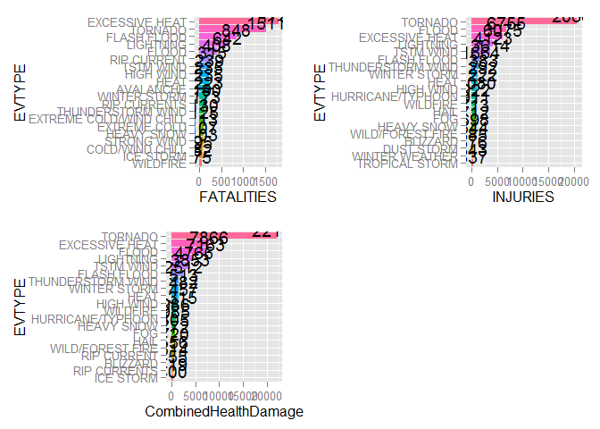

# Data Science - Reproducible Research - Peer Assessment 2 - Analysis of Weather Event using NOAA Storm Database
jmvilaverde  
Monday, June 15, 2015  


***

##Title: Your document should have a title that briefly summarizes your data analysis

#Analysis of Weather Event using NOAA Storm Database 

* Across the United States, which types of events (as indicated in the EVTYPE variable) are most harmful with respect to population health?

* Across the United States, which types of events have the greatest economic consequences?

Consider writing your report as if it were to be read by a government or municipal manager who might be responsible for preparing for severe weather events and will need to prioritize resources for different types of events. However, there is no need to make any specific recommendations in your report.


##Synopsis: 

Immediately after the title, there should be a synopsis which describes and summarizes your analysis in at most 10 complete sentences.

1.
2.
3.
4.
5.
6.
7.
8.
9.
10.

##Data Processing

There should be a section titled Data Processing which describes (in words and code) how the data were loaded into R and processed for analysis. In particular, your analysis must start from the raw CSV file containing the data. You cannot do any preprocessing outside the document. If preprocessing is time-consuming you may consider using the cache = TRUE option for certain code chunks.

First step, adquire the date from "https://d396qusza40orc.cloudfront.net/repdata%2Fdata%2FStormData.csv.bz2" and put into a data frame container:


```r
#Set data path, using setInternet2 to avoid problems with https download
setInternet2(use = TRUE)
dataPath <- "https://d396qusza40orc.cloudfront.net/repdata%2Fdata%2FStormData.csv.bz2"
fileName <- "StormData.csv.bz2"

#Download the file
if (!file.exists(fileName)) download.file(url = dataPath, destfile = fileName)

#Extract bz2 file to a dataframe
dataInitial <- read.csv(bzfile(fileName))
```

As additional information, on [http://www.ncdc.noaa.gov/stormevents/details.jsp?type=eventtype]
inform about information recolection, and only have a complete collection from 1996 to present:
_3. All Event Types (48 from Directive 10-1605): From 1996 to present, 48 event types are recorded as defined in NWS Directive 10-1605._


Get only relevant fields:

```r
#Identify fields
names(dataInitial)
```

```
##  [1] "STATE__"    "BGN_DATE"   "BGN_TIME"   "TIME_ZONE"  "COUNTY"    
##  [6] "COUNTYNAME" "STATE"      "EVTYPE"     "BGN_RANGE"  "BGN_AZI"   
## [11] "BGN_LOCATI" "END_DATE"   "END_TIME"   "COUNTY_END" "COUNTYENDN"
## [16] "END_RANGE"  "END_AZI"    "END_LOCATI" "LENGTH"     "WIDTH"     
## [21] "F"          "MAG"        "FATALITIES" "INJURIES"   "PROPDMG"   
## [26] "PROPDMGEXP" "CROPDMG"    "CROPDMGEXP" "WFO"        "STATEOFFIC"
## [31] "ZONENAMES"  "LATITUDE"   "LONGITUDE"  "LATITUDE_E" "LONGITUDE_"
## [36] "REMARKS"    "REFNUM"
```

```r
#Identify structure
str(dataInitial)
```

```
## 'data.frame':	902297 obs. of  37 variables:
##  $ STATE__   : num  1 1 1 1 1 1 1 1 1 1 ...
##  $ BGN_DATE  : Factor w/ 16335 levels "1/1/1966 0:00:00",..: 6523 6523 4242 11116 2224 2224 2260 383 3980 3980 ...
##  $ BGN_TIME  : Factor w/ 3608 levels "00:00:00 AM",..: 272 287 2705 1683 2584 3186 242 1683 3186 3186 ...
##  $ TIME_ZONE : Factor w/ 22 levels "ADT","AKS","AST",..: 7 7 7 7 7 7 7 7 7 7 ...
##  $ COUNTY    : num  97 3 57 89 43 77 9 123 125 57 ...
##  $ COUNTYNAME: Factor w/ 29601 levels "","5NM E OF MACKINAC BRIDGE TO PRESQUE ISLE LT MI",..: 13513 1873 4598 10592 4372 10094 1973 23873 24418 4598 ...
##  $ STATE     : Factor w/ 72 levels "AK","AL","AM",..: 2 2 2 2 2 2 2 2 2 2 ...
##  $ EVTYPE    : Factor w/ 985 levels "   HIGH SURF ADVISORY",..: 834 834 834 834 834 834 834 834 834 834 ...
##  $ BGN_RANGE : num  0 0 0 0 0 0 0 0 0 0 ...
##  $ BGN_AZI   : Factor w/ 35 levels "","  N"," NW",..: 1 1 1 1 1 1 1 1 1 1 ...
##  $ BGN_LOCATI: Factor w/ 54429 levels "","- 1 N Albion",..: 1 1 1 1 1 1 1 1 1 1 ...
##  $ END_DATE  : Factor w/ 6663 levels "","1/1/1993 0:00:00",..: 1 1 1 1 1 1 1 1 1 1 ...
##  $ END_TIME  : Factor w/ 3647 levels ""," 0900CST",..: 1 1 1 1 1 1 1 1 1 1 ...
##  $ COUNTY_END: num  0 0 0 0 0 0 0 0 0 0 ...
##  $ COUNTYENDN: logi  NA NA NA NA NA NA ...
##  $ END_RANGE : num  0 0 0 0 0 0 0 0 0 0 ...
##  $ END_AZI   : Factor w/ 24 levels "","E","ENE","ESE",..: 1 1 1 1 1 1 1 1 1 1 ...
##  $ END_LOCATI: Factor w/ 34506 levels "","- .5 NNW",..: 1 1 1 1 1 1 1 1 1 1 ...
##  $ LENGTH    : num  14 2 0.1 0 0 1.5 1.5 0 3.3 2.3 ...
##  $ WIDTH     : num  100 150 123 100 150 177 33 33 100 100 ...
##  $ F         : int  3 2 2 2 2 2 2 1 3 3 ...
##  $ MAG       : num  0 0 0 0 0 0 0 0 0 0 ...
##  $ FATALITIES: num  0 0 0 0 0 0 0 0 1 0 ...
##  $ INJURIES  : num  15 0 2 2 2 6 1 0 14 0 ...
##  $ PROPDMG   : num  25 2.5 25 2.5 2.5 2.5 2.5 2.5 25 25 ...
##  $ PROPDMGEXP: Factor w/ 19 levels "","-","?","+",..: 17 17 17 17 17 17 17 17 17 17 ...
##  $ CROPDMG   : num  0 0 0 0 0 0 0 0 0 0 ...
##  $ CROPDMGEXP: Factor w/ 9 levels "","?","0","2",..: 1 1 1 1 1 1 1 1 1 1 ...
##  $ WFO       : Factor w/ 542 levels ""," CI","$AC",..: 1 1 1 1 1 1 1 1 1 1 ...
##  $ STATEOFFIC: Factor w/ 250 levels "","ALABAMA, Central",..: 1 1 1 1 1 1 1 1 1 1 ...
##  $ ZONENAMES : Factor w/ 25112 levels "","                                                                                                                               "| __truncated__,..: 1 1 1 1 1 1 1 1 1 1 ...
##  $ LATITUDE  : num  3040 3042 3340 3458 3412 ...
##  $ LONGITUDE : num  8812 8755 8742 8626 8642 ...
##  $ LATITUDE_E: num  3051 0 0 0 0 ...
##  $ LONGITUDE_: num  8806 0 0 0 0 ...
##  $ REMARKS   : Factor w/ 436781 levels "","-2 at Deer Park\n",..: 1 1 1 1 1 1 1 1 1 1 ...
##  $ REFNUM    : num  1 2 3 4 5 6 7 8 9 10 ...
```

```r
#Get a general overview
summary(dataInitial)
```

```
##     STATE__                  BGN_DATE             BGN_TIME     
##  Min.   : 1.0   5/25/2011 0:00:00:  1202   12:00:00 AM: 10163  
##  1st Qu.:19.0   4/27/2011 0:00:00:  1193   06:00:00 PM:  7350  
##  Median :30.0   6/9/2011 0:00:00 :  1030   04:00:00 PM:  7261  
##  Mean   :31.2   5/30/2004 0:00:00:  1016   05:00:00 PM:  6891  
##  3rd Qu.:45.0   4/4/2011 0:00:00 :  1009   12:00:00 PM:  6703  
##  Max.   :95.0   4/2/2006 0:00:00 :   981   03:00:00 PM:  6700  
##                 (Other)          :895866   (Other)    :857229  
##    TIME_ZONE          COUNTY           COUNTYNAME         STATE       
##  CST    :547493   Min.   :  0.0   JEFFERSON :  7840   TX     : 83728  
##  EST    :245558   1st Qu.: 31.0   WASHINGTON:  7603   KS     : 53440  
##  MST    : 68390   Median : 75.0   JACKSON   :  6660   OK     : 46802  
##  PST    : 28302   Mean   :100.6   FRANKLIN  :  6256   MO     : 35648  
##  AST    :  6360   3rd Qu.:131.0   LINCOLN   :  5937   IA     : 31069  
##  HST    :  2563   Max.   :873.0   MADISON   :  5632   NE     : 30271  
##  (Other):  3631                   (Other)   :862369   (Other):621339  
##                EVTYPE         BGN_RANGE           BGN_AZI      
##  HAIL             :288661   Min.   :   0.000          :547332  
##  TSTM WIND        :219940   1st Qu.:   0.000   N      : 86752  
##  THUNDERSTORM WIND: 82563   Median :   0.000   W      : 38446  
##  TORNADO          : 60652   Mean   :   1.484   S      : 37558  
##  FLASH FLOOD      : 54277   3rd Qu.:   1.000   E      : 33178  
##  FLOOD            : 25326   Max.   :3749.000   NW     : 24041  
##  (Other)          :170878                      (Other):134990  
##          BGN_LOCATI                  END_DATE             END_TIME     
##               :287743                    :243411              :238978  
##  COUNTYWIDE   : 19680   4/27/2011 0:00:00:  1214   06:00:00 PM:  9802  
##  Countywide   :   993   5/25/2011 0:00:00:  1196   05:00:00 PM:  8314  
##  SPRINGFIELD  :   843   6/9/2011 0:00:00 :  1021   04:00:00 PM:  8104  
##  SOUTH PORTION:   810   4/4/2011 0:00:00 :  1007   12:00:00 PM:  7483  
##  NORTH PORTION:   784   5/30/2004 0:00:00:   998   11:59:00 PM:  7184  
##  (Other)      :591444   (Other)          :653450   (Other)    :622432  
##    COUNTY_END COUNTYENDN       END_RANGE           END_AZI      
##  Min.   :0    Mode:logical   Min.   :  0.0000          :724837  
##  1st Qu.:0    NA's:902297    1st Qu.:  0.0000   N      : 28082  
##  Median :0                   Median :  0.0000   S      : 22510  
##  Mean   :0                   Mean   :  0.9862   W      : 20119  
##  3rd Qu.:0                   3rd Qu.:  0.0000   E      : 20047  
##  Max.   :0                   Max.   :925.0000   NE     : 14606  
##                                                 (Other): 72096  
##            END_LOCATI         LENGTH              WIDTH         
##                 :499225   Min.   :   0.0000   Min.   :   0.000  
##  COUNTYWIDE     : 19731   1st Qu.:   0.0000   1st Qu.:   0.000  
##  SOUTH PORTION  :   833   Median :   0.0000   Median :   0.000  
##  NORTH PORTION  :   780   Mean   :   0.2301   Mean   :   7.503  
##  CENTRAL PORTION:   617   3rd Qu.:   0.0000   3rd Qu.:   0.000  
##  SPRINGFIELD    :   575   Max.   :2315.0000   Max.   :4400.000  
##  (Other)        :380536                                         
##        F               MAG            FATALITIES          INJURIES        
##  Min.   :0.0      Min.   :    0.0   Min.   :  0.0000   Min.   :   0.0000  
##  1st Qu.:0.0      1st Qu.:    0.0   1st Qu.:  0.0000   1st Qu.:   0.0000  
##  Median :1.0      Median :   50.0   Median :  0.0000   Median :   0.0000  
##  Mean   :0.9      Mean   :   46.9   Mean   :  0.0168   Mean   :   0.1557  
##  3rd Qu.:1.0      3rd Qu.:   75.0   3rd Qu.:  0.0000   3rd Qu.:   0.0000  
##  Max.   :5.0      Max.   :22000.0   Max.   :583.0000   Max.   :1700.0000  
##  NA's   :843563                                                           
##     PROPDMG          PROPDMGEXP        CROPDMG          CROPDMGEXP    
##  Min.   :   0.00          :465934   Min.   :  0.000          :618413  
##  1st Qu.:   0.00   K      :424665   1st Qu.:  0.000   K      :281832  
##  Median :   0.00   M      : 11330   Median :  0.000   M      :  1994  
##  Mean   :  12.06   0      :   216   Mean   :  1.527   k      :    21  
##  3rd Qu.:   0.50   B      :    40   3rd Qu.:  0.000   0      :    19  
##  Max.   :5000.00   5      :    28   Max.   :990.000   B      :     9  
##                    (Other):    84                     (Other):     9  
##       WFO                                       STATEOFFIC    
##         :142069                                      :248769  
##  OUN    : 17393   TEXAS, North                       : 12193  
##  JAN    : 13889   ARKANSAS, Central and North Central: 11738  
##  LWX    : 13174   IOWA, Central                      : 11345  
##  PHI    : 12551   KANSAS, Southwest                  : 11212  
##  TSA    : 12483   GEORGIA, North and Central         : 11120  
##  (Other):690738   (Other)                            :595920  
##                                                                                                                                                                                                     ZONENAMES     
##                                                                                                                                                                                                          :594029  
##                                                                                                                                                                                                          :205988  
##  GREATER RENO / CARSON CITY / M - GREATER RENO / CARSON CITY / M                                                                                                                                         :   639  
##  GREATER LAKE TAHOE AREA - GREATER LAKE TAHOE AREA                                                                                                                                                       :   592  
##  JEFFERSON - JEFFERSON                                                                                                                                                                                   :   303  
##  MADISON - MADISON                                                                                                                                                                                       :   302  
##  (Other)                                                                                                                                                                                                 :100444  
##     LATITUDE      LONGITUDE        LATITUDE_E     LONGITUDE_    
##  Min.   :   0   Min.   :-14451   Min.   :   0   Min.   :-14455  
##  1st Qu.:2802   1st Qu.:  7247   1st Qu.:   0   1st Qu.:     0  
##  Median :3540   Median :  8707   Median :   0   Median :     0  
##  Mean   :2875   Mean   :  6940   Mean   :1452   Mean   :  3509  
##  3rd Qu.:4019   3rd Qu.:  9605   3rd Qu.:3549   3rd Qu.:  8735  
##  Max.   :9706   Max.   : 17124   Max.   :9706   Max.   :106220  
##  NA's   :47                      NA's   :40                     
##                                            REMARKS           REFNUM      
##                                                :287433   Min.   :     1  
##                                                : 24013   1st Qu.:225575  
##  Trees down.\n                                 :  1110   Median :451149  
##  Several trees were blown down.\n              :   568   Mean   :451149  
##  Trees were downed.\n                          :   446   3rd Qu.:676723  
##  Large trees and power lines were blown down.\n:   432   Max.   :902297  
##  (Other)                                       :588295
```


```r
#Data filtered by year >= 1996
library(lubridate)
dataInitial$date <- as.Date(dataInitial$BGN_DATE, format = "%m/%d/%Y")
dataInitial$year <- year(dataInitial$date)
dataYearProcessed <- dataInitial[dataInitial$year>=1996,]

#Percent of data removed filtering by Year
summary(dataInitial$year>=1996)
```

```
##    Mode   FALSE    TRUE    NA's 
## logical  248767  653530       0
```

```r
percentDataRemYear <- sum(!dataInitial$year>=1996)/nrow(dataInitial)

#Data filtered by States
dataStatesProcessed <- dataYearProcessed[dataYearProcessed$STATE %in% state.abb,]

#Percent of data removed filtering by State
summary(dataYearProcessed$STATE %in% state.abb)
```

```
##    Mode   FALSE    TRUE    NA's 
## logical   18704  634826       0
```

```r
percentDataRemStates <- sum(!dataYearProcessed$STATE %in% state.abb)/nrow(dataYearProcessed)

summary(dataStatesProcessed)
```

```
##     STATE__                   BGN_DATE             BGN_TIME     
##  Min.   : 1.00   5/25/2011 0:00:00:  1199   12:00:00 AM:  9982  
##  1st Qu.:19.00   4/27/2011 0:00:00:  1182   06:00:00 PM:  7186  
##  Median :29.00   5/30/2004 0:00:00:  1009   04:00:00 PM:  7018  
##  Mean   :29.83   4/4/2011 0:00:00 :  1006   05:00:00 PM:  6696  
##  3rd Qu.:42.00   4/2/2006 0:00:00 :   981   12:00:00 PM:  6521  
##  Max.   :56.00   4/19/2011 0:00:00:   968   03:00:00 PM:  6469  
##                  (Other)          :628481   (Other)    :590954  
##    TIME_ZONE          COUNTY            COUNTYNAME         STATE       
##  CST    :330406   Min.   :  1.00   WASHINGTON:  5311   TX     : 51335  
##  EST    :213976   1st Qu.: 29.00   JEFFERSON :  5112   KS     : 38649  
##  MST    : 63241   Median : 72.00   FRANKLIN  :  4374   OK     : 26980  
##  PST    : 20722   Mean   : 92.66   JACKSON   :  4352   MO     : 25802  
##  AST    :  2491   3rd Qu.:125.00   LINCOLN   :  4086   IA     : 22712  
##  HST    :  2450   Max.   :840.00   MADISON   :  3929   IL     : 21215  
##  (Other):  1540                    (Other)   :607662   (Other):448133  
##                EVTYPE         BGN_RANGE          BGN_AZI      
##  HAIL             :207684   Min.   :  0.000          :305836  
##  TSTM WIND        :128568   1st Qu.:  0.000   N      : 81590  
##  THUNDERSTORM WIND: 81316   Median :  0.000   W      : 35483  
##  FLASH FLOOD      : 50011   Mean   :  1.828   S      : 33898  
##  FLOOD            : 23873   3rd Qu.:  2.000   E      : 30255  
##  TORNADO          : 23139   Max.   :520.000   NW     : 22355  
##  (Other)          :120235                     (Other):125409  
##          BGN_LOCATI                  END_DATE             END_TIME     
##               : 89178   4/27/2011 0:00:00:  1203   06:00:00 PM:  9512  
##  COUNTYWIDE   : 19351   5/25/2011 0:00:00:  1193   05:00:00 PM:  8066  
##  SPRINGFIELD  :   843   4/4/2011 0:00:00 :  1004   04:00:00 PM:  7838  
##  SOUTH PORTION:   803   5/30/2004 0:00:00:   991   12:00:00 PM:  7343  
##  NORTH PORTION:   767   4/7/2006 0:00:00 :   986   11:59:00 PM:  7003  
##  COLUMBIA     :   750   4/2/2006 0:00:00 :   966   03:00:00 PM:  6907  
##  (Other)      :523134   (Other)          :628483   (Other)    :588157  
##    COUNTY_END COUNTYENDN       END_RANGE          END_AZI      
##  Min.   :0    Mode:logical   Min.   :  0.000          :462342  
##  1st Qu.:0    NA's:634826    1st Qu.:  0.000   N      : 27476  
##  Median :0                   Median :  0.000   S      : 21679  
##  Mean   :0                   Mean   :  1.307   W      : 19752  
##  3rd Qu.:0                   3rd Qu.:  1.000   E      : 19367  
##  Max.   :0                   Max.   :176.000   NE     : 14271  
##                                                (Other): 69939  
##          END_LOCATI         LENGTH             WIDTH        
##               :245328   Min.   :  0.0000   Min.   :   0.00  
##  COUNTYWIDE   : 19404   1st Qu.:  0.0000   1st Qu.:   0.00  
##  SOUTH PORTION:   826   Median :  0.0000   Median :   0.00  
##  NORTH PORTION:   763   Mean   :  0.1043   Mean   :   4.77  
##  SPRINGFIELD  :   575   3rd Qu.:  0.0000   3rd Qu.:   0.00  
##  COLUMBIA     :   558   Max.   :400.0000   Max.   :4400.00  
##  (Other)      :367372                                       
##        F               MAG             FATALITIES          INJURIES       
##  Min.   :0.0      Min.   :    0.00   Min.   :  0.0000   Min.   :0.00e+00  
##  1st Qu.:0.0      1st Qu.:    0.00   1st Qu.:  0.0000   1st Qu.:0.00e+00  
##  Median :0.0      Median :   50.00   Median :  0.0000   Median :0.00e+00  
##  Mean   :0.6      Mean   :   45.81   Mean   :  0.0133   Mean   :8.97e-02  
##  3rd Qu.:1.0      3rd Qu.:   75.00   3rd Qu.:  0.0000   3rd Qu.:0.00e+00  
##  Max.   :5.0      Max.   :22000.00   Max.   :158.0000   Max.   :1.15e+03  
##  NA's   :611681                                                           
##     PROPDMG          PROPDMGEXP        CROPDMG         CROPDMGEXP    
##  Min.   :   0.00   K      :360754   Min.   :  0.00          :362955  
##  1st Qu.:   0.00          :266739   1st Qu.:  0.00   K      :270121  
##  Median :   0.00   M      :  7301   Median :  0.00   M      :  1746  
##  Mean   :  11.95   B      :    31   Mean   :  1.88   B      :     4  
##  3rd Qu.:   1.50   0      :     1   3rd Qu.:  0.00   ?      :     0  
##  Max.   :5000.00   -      :     0   Max.   :990.00   0      :     0  
##                    (Other):     0                    (Other):     0  
##       WFO                                       STATEOFFIC    
##  OUN    : 17393   TEXAS, North                       : 12193  
##  TSA    : 12483   ARKANSAS, Central and North Central: 11738  
##  JAN    : 12446   IOWA, Central                      : 11345  
##  FWD    : 12193   KANSAS, Southwest                  : 11212  
##  PHI    : 12190   GEORGIA, North and Central         : 11120  
##  LZK    : 11738   KANSAS, Southeast                  : 10960  
##  (Other):556383   (Other)                            :566258  
##                                                                                                                                                                                                     ZONENAMES     
##                                                                                                                                                                                                          :340563  
##                                                                                                                                                                                                          :205075  
##  GREATER RENO / CARSON CITY / M - GREATER RENO / CARSON CITY / M                                                                                                                                         :   624  
##  GREATER LAKE TAHOE AREA - GREATER LAKE TAHOE AREA                                                                                                                                                       :   591  
##  MADISON - MADISON                                                                                                                                                                                       :   296  
##  MONO - MONO                                                                                                                                                                                             :   294  
##  (Other)                                                                                                                                                                                                 : 87383  
##     LATITUDE      LONGITUDE       LATITUDE_E     LONGITUDE_    
##  Min.   :   0   Min.   :    0   Min.   :   0   Min.   :     0  
##  1st Qu.:2939   1st Qu.: 7340   1st Qu.:   0   1st Qu.:     0  
##  Median :3604   Median : 8700   Median :3027   Median :  7558  
##  Mean   :2913   Mean   : 6982   Mean   :1973   Mean   :  4764  
##  3rd Qu.:4026   3rd Qu.: 9559   3rd Qu.:3812   3rd Qu.:  9229  
##  Max.   :9706   Max.   :16612   Max.   :9706   Max.   :106220  
##                                                                
##                                            REMARKS           REFNUM      
##                                                : 97473   Min.   :248768  
##  Trees down.\n                                 :  1110   1st Qu.:408351  
##  Several trees were blown down.\n              :   568   Median :573032  
##  Trees were downed.\n                          :   446   Mean   :573347  
##  Large trees and power lines were blown down.\n:   432   3rd Qu.:736776  
##  A few trees were blown down.\n                :   398   Max.   :902297  
##  (Other)                                       :534399                   
##       date                 year     
##  Min.   :1996-01-01   Min.   :1996  
##  1st Qu.:2000-09-02   1st Qu.:2000  
##  Median :2005-05-08   Median :2005  
##  Mean   :2004-10-08   Mean   :2004  
##  3rd Qu.:2008-08-14   3rd Qu.:2008  
##  Max.   :2011-11-30   Max.   :2011  
## 
```


```r
library(dplyr)
```

```
## 
## Attaching package: 'dplyr'
## 
## The following objects are masked from 'package:lubridate':
## 
##     intersect, setdiff, union
## 
## The following object is masked from 'package:stats':
## 
##     filter
## 
## The following objects are masked from 'package:base':
## 
##     intersect, setdiff, setequal, union
```

```r
#Select only necesary fields: Type of event, Number of fatalities, Number of injuries, Property damages, Property damages exponent,
#Crop damages, and Crop damages exponent.
dataStatesProcessed %>% 
        select(EVTYPE, FATALITIES, INJURIES, PROPDMG, PROPDMGEXP, CROPDMG, CROPDMGEXP) -> dataPreprocessed
        

#Evaluate how many levels have the dataset
unique(dataPreprocessed$EVTYPE)
```

```
##   [1] WINTER STORM                   TORNADO                       
##   [3] TSTM WIND                      HAIL                          
##   [5] HIGH WIND                      HEAVY RAIN                    
##   [7] FLASH FLOOD                    FREEZING RAIN                 
##   [9] EXTREME COLD                   EXCESSIVE HEAT                
##  [11] LIGHTNING                      FUNNEL CLOUD                  
##  [13] EXTREME WINDCHILL              BLIZZARD                      
##  [15] URBAN/SML STREAM FLD           FLOOD                         
##  [17] TSTM WIND/HAIL                 WATERSPOUT                    
##  [19] RIP CURRENTS                   HEAVY SNOW                    
##  [21] Other                          Record dry month              
##  [23] Temperature record             WILD/FOREST FIRE              
##  [25] Minor Flooding                 ICE STORM                     
##  [27] STORM SURGE                    Ice jam flood (minor          
##  [29] High Wind                      DUST STORM                    
##  [31] STRONG WIND                    DUST DEVIL                    
##  [33] Tstm Wind                      DROUGHT                       
##  [35] DRY MICROBURST                 FOG                           
##  [37] ROUGH SURF                     Wind                          
##  [39] THUNDERSTORMS                  Heavy Surf                    
##  [41] HEAVY SURF                     Dust Devil                    
##  [43] Wind Damage                    Marine Accident               
##  [45] Snow                           AVALANCHE                     
##  [47] Freeze                         TROPICAL STORM                
##  [49] Snow Squalls                   Coastal Flooding              
##  [51] Heavy Rain                     Strong Wind                   
##  [53] WINDS                          WIND                          
##  [55] COASTAL FLOOD                  COASTAL STORM                 
##  [57] COASTALFLOOD                   Erosion/Cstl Flood            
##  [59] Heavy Rain and Wind            Light Snow/Flurries           
##  [61] Wet Month                      Wet Year                      
##  [63] SNOW                           DAMAGING FREEZE               
##  [65] Damaging Freeze                HURRICANE                     
##  [67] Beach Erosion                  Hot and Dry                   
##  [69] Flood/Flash Flood              Icy Roads                     
##  [71] High Surf                      Heavy Rain/High Surf          
##  [73] HIGH SURF                      Thunderstorm Wind             
##  [75] Rain Damage                    ICE JAM                       
##  [77] Unseasonable Cold              Early Frost                   
##  [79] Wintry Mix                     blowing snow                  
##  [81] STREET FLOODING                Record Cold                   
##  [83] Extreme Cold                   Ice Fog                       
##  [85] Excessive Cold                 Torrential Rainfall           
##  [87] Freezing Rain                  Landslump                     
##  [89] Late-season Snowfall           Hurricane Edouard             
##  [91] Coastal Storm                  Flood                         
##  [93] HEAVY RAIN/WIND                River Flooding                
##  [95] TIDAL FLOODING                 Tidal Flooding                
##  [97] Winter Weather                 Snow squalls                  
##  [99] Strong Winds                   Strong winds                  
## [101] RECORD WARM TEMPS.             Ice/Snow                      
## [103] Mudslide                       Glaze                         
## [105] Extended Cold                  Snow Accumulation             
## [107] Freezing Fog                   Drifting Snow                 
## [109] Whirlwind                      Heavy snow shower             
## [111] Heavy rain                     COASTAL FLOODING              
## [113] LATE SNOW                      Record May Snow               
## [115] Record Winter Snow             Heavy Precipitation           
## [117]  COASTAL FLOOD                 Record temperature            
## [119] Light snow                     Late Season Snowfall          
## [121] Gusty Wind                     small hail                    
## [123] Light Snow                     MIXED PRECIP                  
## [125] Black Ice                      Mudslides                     
## [127] Gradient wind                  Snow and Ice                  
## [129] COLD                           Freezing Spray                
## [131] DOWNBURST                      Summary Jan 17                
## [133] Summary of March 14            Summary of March 23           
## [135] Summary of March 24            Summary of April 3rd          
## [137] Summary of April 12            Summary of April 13           
## [139] Summary of April 21            Summary August 11             
## [141] Summary of April 27            Summary of May 9-10           
## [143] Summary of May 10              Summary of May 13             
## [145] Summary of May 14              Summary of May 22 am          
## [147] Summary of May 22 pm           Heatburst                     
## [149] Summary of May 26 am           Summary of May 26 pm          
## [151] Metro Storm, May 26            Summary of May 31 am          
## [153] Summary of May 31 pm           Summary of June 3             
## [155] Summary of June 4              Summary June 5-6              
## [157] Summary June 6                 Summary of June 11            
## [159] Summary of June 12             Summary of June 13            
## [161] Summary of June 15             Summary of June 16            
## [163] Summary June 18-19             Summary of June 23            
## [165] Summary of June 24             Summary of June 30            
## [167] Summary of July 2              Summary of July 3             
## [169] Summary of July 11             Summary of July 22            
## [171] Summary July 23-24             Summary of July 26            
## [173] Summary of July 29             Summary of August 1           
## [175] Summary August 2-3             Summary August 7              
## [177] Summary August 9               Summary August 10             
## [179] Summary August 17              Summary August 21             
## [181] Summary August 28              Summary September 4           
## [183] Summary September 20           Summary September 23          
## [185] Summary Sept. 25-26            Summary: Oct. 20-21           
## [187] Summary: October 31            Summary: Nov. 6-7             
## [189] Summary: Nov. 16               Microburst                    
## [191] wet micoburst                  HAIL/WIND                     
## [193] Hail(0.75)                     Funnel Cloud                  
## [195] Urban Flooding                 No Severe Weather             
## [197] Urban flood                    Urban Flood                   
## [199] Cold                           WINTER WEATHER                
## [201] Summary of May 22              Summary of June 6             
## [203] Summary August 4               Summary of June 10            
## [205] Summary of June 18             Summary September 3           
## [207] Summary: Sept. 18              Coastal Flood                 
## [209] coastal flooding               Small Hail                    
## [211] Record Temperatures            Light Snowfall                
## [213] Freezing Drizzle               Gusty wind/rain               
## [215] GUSTY WIND/HVY RAIN            Blowing Snow                  
## [217] Early snowfall                 Monthly Snowfall              
## [219] Record Heat                    Seasonal Snowfall             
## [221] Monthly Rainfall               Cold Temperature              
## [223] Sml Stream Fld                 Heat Wave                     
## [225] Thundersnow shower             NONE                          
## [227] COLD AND SNOW                  DAM BREAK                     
## [229] RAIN                           RAIN/SNOW                     
## [231] OTHER                          FREEZE                        
## [233] TSTM WIND (G45)                RECORD WARMTH                 
## [235] STRONG WINDS                   FREEZING DRIZZLE              
## [237] UNSEASONABLY WARM              SLEET/FREEZING RAIN           
## [239] BLACK ICE                      WINTRY MIX                    
## [241] BLOW-OUT TIDES                 UNSEASONABLY COLD             
## [243] UNSEASONABLY COOL              TSTM HEAVY RAIN               
## [245] UNSEASONABLY DRY               TSTM WIND 40                  
## [247] TSTM WIND 45                   HARD FREEZE                   
## [249] TSTM WIND (41)                 HEAT                          
## [251] RIVER FLOOD                    TSTM WIND (G40)               
## [253] RIP CURRENT                    TSTM WND                      
## [255] DENSE FOG                      Wintry mix                    
## [257]  TSTM WIND                     MUD SLIDE                     
## [259] MUDSLIDES                      MUDSLIDE                      
## [261] Frost                          Frost/Freeze                  
## [263] SNOW AND ICE                   WIND DAMAGE                   
## [265] RAIN (HEAVY)                   Record Warmth                 
## [267] Prolong Cold                   Cold and Frost                
## [269] RECORD COLD                    PROLONG COLD                  
## [271] Gusty Winds                    AGRICULTURAL FREEZE           
## [273] URBAN/SML STREAM FLDG          GUSTY WIND                    
## [275] SNOW SQUALL                    HEAVY SNOW SQUALLS            
## [277] SNOW/ICE                       GUSTY WINDS                   
## [279] SMALL HAIL                     SNOW SQUALLS                  
## [281] LAKE EFFECT SNOW               STRONG WIND GUST              
## [283] LATE FREEZE                    RECORD TEMPERATURES           
## [285] ICY ROADS                      RECORD SNOWFALL               
## [287] BLOW-OUT TIDE                  THUNDERSTORM                  
## [289] Hypothermia/Exposure           HYPOTHERMIA/EXPOSURE          
## [291] Lake Effect Snow               Mixed Precipitation           
## [293] Record High                    COASTALSTORM                  
## [295] LIGHT SNOW                     Snow and sleet                
## [297] Freezing rain                  Gusty winds                   
## [299] FUNNEL CLOUDS                  WATERSPOUTS                   
## [301] Blizzard Summary               FROST                         
## [303] ICE                            SUMMARY OF MARCH 24-25        
## [305] SUMMARY OF MARCH 27            SUMMARY OF MARCH 29           
## [307] GRADIENT WIND                  Icestorm/Blizzard             
## [309] Flood/Strong Wind              TSTM WIND AND LIGHTNING       
## [311] gradient wind                  SEVERE THUNDERSTORMS          
## [313] EXCESSIVE RAIN                 Freezing drizzle              
## [315] Mountain Snows                 URBAN/SMALL STRM FLDG         
## [317] WET MICROBURST                 Heavy surf and wind           
## [319] Mild and Dry Pattern           COLD AND FROST                
## [321] RECORD HEAT                     LIGHTNING                    
## [323] BEACH EROSION                  UNSEASONAL RAIN               
## [325] EARLY RAIN                     PROLONGED RAIN                
## [327] WINTERY MIX                    COASTAL FLOODING/EROSION      
## [329] UNSEASONABLY WET               HOT SPELL                     
## [331] HEAT WAVE                      UNSEASONABLY HOT              
## [333] UNSEASONABLY WARM AND DRY       TSTM WIND (G45)              
## [335] TSTM WIND  (G45)               HIGH WIND (G40)               
## [337] TSTM WIND (G35)                DRY WEATHER                   
## [339] TSTM WINDS                     FREEZING RAIN/SLEET           
## [341] ABNORMAL WARMTH                UNUSUAL WARMTH                
## [343] GLAZE                          WAKE LOW WIND                 
## [345] MONTHLY RAINFALL               COLD TEMPERATURES             
## [347] COLD WIND CHILL TEMPERATURES   MODERATE SNOW                 
## [349] MODERATE SNOWFALL              URBAN/STREET FLOODING         
## [351] COASTAL EROSION                UNUSUAL/RECORD WARMTH         
## [353] BITTER WIND CHILL              BITTER WIND CHILL TEMPERATURES
## [355] SEICHE                         TSTM                          
## [357] COASTAL  FLOODING/EROSION      SNOW DROUGHT                  
## [359] UNSEASONABLY WARM YEAR         HYPERTHERMIA/EXPOSURE         
## [361] SNOW/SLEET                     ROCK SLIDE                    
## [363] ICE PELLETS                    URBAN FLOOD                   
## [365] PATCHY DENSE FOG               RECORD COOL                   
## [367] RECORD WARM                    HOT WEATHER                   
## [369] RIVER FLOODING                 RECORD TEMPERATURE            
## [371] VOLCANIC ERUPTION              COOL SPELL                    
## [373] WIND ADVISORY                  GUSTY WIND/HAIL               
## [375] RED FLAG FIRE WX               FIRST FROST                   
## [377] EXCESSIVELY DRY                HEAVY SEAS                    
## [379] FLASH FLOOD/FLOOD              SNOW AND SLEET                
## [381] LIGHT SNOW/FREEZING PRECIP     VOG                           
## [383] EXCESSIVE RAINFALL             FLASH FLOODING                
## [385] MONTHLY PRECIPITATION          MONTHLY TEMPERATURE           
## [387] RECORD DRYNESS                 EXTREME WINDCHILL TEMPERATURES
## [389] MIXED PRECIPITATION            EXTREME WIND CHILL            
## [391] DRY CONDITIONS                 HEAVY RAINFALL                
## [393] REMNANTS OF FLOYD              EARLY SNOWFALL                
## [395] FREEZING FOG                   LANDSPOUT                     
## [397] DRIEST MONTH                   RECORD  COLD                  
## [399] LATE SEASON HAIL               EXCESSIVE SNOW                
## [401] WINTER MIX                     DRYNESS                       
## [403] FLOOD/FLASH/FLOOD              WIND AND WAVE                 
## [405] SEVERE THUNDERSTORM            LIGHT FREEZING RAIN           
## [407]  WIND                          MONTHLY SNOWFALL              
## [409] DRY                            RECORD RAINFALL               
## [411] RECORD PRECIPITATION           ICE ROADS                     
## [413] SLEET                          HIGH SEAS                     
## [415] ROUGH SEAS                     UNSEASONABLY WARM/WET         
## [417] UNSEASONABLY COOL & WET        TSTM WIND G45                 
## [419] NON SEVERE HAIL                RECORD SNOW                   
## [421] SNOW/FREEZING RAIN             SNOW/BLOWING SNOW             
## [423] NON-SEVERE WIND DAMAGE         UNUSUALLY COLD                
## [425] UNUSUALLY WARM                 WARM WEATHER                  
## [427] LANDSLUMP                      THUNDERSTORM WIND (G40)       
## [429] LANDSLIDE                      WALL CLOUD                    
## [431] HIGH WATER                     UNSEASONABLY WARM & WET       
## [433]  FLASH FLOOD                   LOCALLY HEAVY RAIN            
## [435] WIND GUSTS                     VOLCANIC ASH                  
## [437] LATE SEASON SNOW               GUSTY LAKE WIND               
## [439] ABNORMALLY DRY                 WINTER WEATHER MIX            
## [441] RED FLAG CRITERIA              WND                           
## [443] CSTL FLOODING/EROSION          SMOKE                         
## [445]  WATERSPOUT                    SNOW ADVISORY                 
## [447] EXTREMELY WET                  UNUSUALLY LATE SNOW           
## [449] VERY DRY                       RECORD LOW RAINFALL           
## [451] ROGUE WAVE                     SNOWMELT FLOODING             
## [453] PROLONG WARMTH                 ACCUMULATED SNOWFALL          
## [455] FALLING SNOW/ICE               DUST DEVEL                    
## [457] NON-TSTM WIND                  NON TSTM WIND                 
## [459] DRY SPELL                      BRUSH FIRE                    
## [461] GUSTY THUNDERSTORM WINDS       PATCHY ICE                    
## [463] SNOW SHOWERS                   HEAVY RAIN EFFECTS            
## [465] BLOWING DUST                   EXCESSIVE HEAT/DROUGHT        
## [467] NORTHERN LIGHTS                WIND CHILL                    
## [469] HAZARDOUS SURF                 WILDFIRE                      
## [471] FROST/FREEZE                   WINTER WEATHER/MIX            
## [473] ASTRONOMICAL HIGH TIDE         WHIRLWIND                     
## [475] VERY WARM                      ABNORMALLY WET                
## [477] TORNADO DEBRIS                 EXTREME COLD/WIND CHILL       
## [479] ICE ON ROAD                    FIRST SNOW                    
## [481] ICE/SNOW                       DROWNING                      
## [483] GUSTY THUNDERSTORM WIND        HEAVY SURF/HIGH SURF          
## [485] TROPICAL DEPRESSION            SLEET STORM                   
## [487] HURRICANE/TYPHOON              STORM SURGE/TIDE              
## [489] COLD/WIND CHILL                LAKE-EFFECT SNOW              
## [491] THUNDERSTORM WIND              TSUNAMI                       
## [493] DENSE SMOKE                    LAKESHORE FLOOD               
## [495] ASTRONOMICAL LOW TIDE         
## 985 Levels:    HIGH SURF ADVISORY  COASTAL FLOOD ... WND
```

```r
#Remove Summary from event type
dataPreprocessed <- dataPreprocessed[!grepl(pattern = "Summary", x=dataPreprocessed$EVTYPE),]

#Create Property damage total
#Type of exponents -> Billion, Million, K thousand
summary(dataPreprocessed)
```

```
##                EVTYPE         FATALITIES          INJURIES       
##  HAIL             :207684   Min.   :  0.0000   Min.   :0.00e+00  
##  TSTM WIND        :128568   1st Qu.:  0.0000   1st Qu.:0.00e+00  
##  THUNDERSTORM WIND: 81316   Median :  0.0000   Median :0.00e+00  
##  FLASH FLOOD      : 50011   Mean   :  0.0133   Mean   :8.97e-02  
##  FLOOD            : 23873   3rd Qu.:  0.0000   3rd Qu.:0.00e+00  
##  TORNADO          : 23139   Max.   :158.0000   Max.   :1.15e+03  
##  (Other)          :120162                                        
##     PROPDMG          PROPDMGEXP        CROPDMG         CROPDMGEXP    
##  Min.   :   0.00   K      :360754   Min.   :  0.00          :362882  
##  1st Qu.:   0.00          :266666   1st Qu.:  0.00   K      :270121  
##  Median :   0.00   M      :  7301   Median :  0.00   M      :  1746  
##  Mean   :  11.95   B      :    31   Mean   :  1.88   B      :     4  
##  3rd Qu.:   1.50   0      :     1   3rd Qu.:  0.00   ?      :     0  
##  Max.   :5000.00   -      :     0   Max.   :990.00   0      :     0  
##                    (Other):     0                    (Other):     0
```

```r
dataPreprocessed %>%
         mutate(CombinedHealthDamage = FATALITIES + INJURIES) -> dataPreprocessed 

dataPreprocessed %>%
         mutate(multiPROPDM = ifelse(PROPDMGEXP == 'B', 10^9, 
                                     ifelse(PROPDMGEXP == 'M', 10^6, 
                                            ifelse(PROPDMGEXP == 'K', 10^3, 
                                                   ifelse(PROPDMGEXP == 'H', 100, 1))))) %>%
         mutate(totalPROPDMG = as.numeric(multiPROPDM) * as.numeric(PROPDMG)) -> dataPreprocessed
```


```r
##TOP 20 of Fatalities per Event Type
dataAgregateFatalities <- with(dataPreprocessed, aggregate(FATALITIES, list(EVTYPE), sum))
dataAgregateFatalities <- rename(dataAgregateFatalities, EVTYPE = Group.1, FATALITIES = x)
dAFatalitiesTop20 <-arrange(dataAgregateFatalities,desc(FATALITIES))[1:20,]

#TOP 20 of Injuries per Event Type
dataAgregateINJURIES <- with(dataPreprocessed, aggregate(INJURIES, list(EVTYPE), sum))
dataAgregateINJURIES <- rename(dataAgregateINJURIES, EVTYPE = Group.1, INJURIES = x)
dAINJURIESTop20 <- arrange(dataAgregateINJURIES, desc(INJURIES))[1:20,]

#TOP 20 of Combined Health Damage per Event Type
dataAgregateCombined <- with(dataPreprocessed, aggregate(CombinedHealthDamage, list(EVTYPE), sum))
dataAgregateCombined <- rename(dataAgregateCombined, EVTYPE = Group.1, CombinedHealthDamage = x)
dACOMBINEDTop20 <- arrange(dataAgregateCombined, desc(CombinedHealthDamage))[1:20,]

#Change the factor order
dAFatalitiesTop20$EVTYPE <- factor(dAFatalitiesTop20$EVTYPE, levels = dAFatalitiesTop20$EVTYPE[order(dAFatalitiesTop20$FATALITIES)])
dAINJURIESTop20$EVTYPE <- factor(dAINJURIESTop20$EVTYPE, levels = dAINJURIESTop20$EVTYPE[order(dAINJURIESTop20$INJURIES)])
dACOMBINEDTop20$EVTYPE <- factor(dACOMBINEDTop20$EVTYPE, levels = dACOMBINEDTop20$EVTYPE[order(dACOMBINEDTop20$CombinedHealthDamage)])
```


```r
library(ggplot2)

gf <- ggplot(data=dAFatalitiesTop20, aes(x=EVTYPE, y=FATALITIES , fill=EVTYPE))
gf <- gf + geom_bar(stat="identity", show_guide = FALSE)
gf <- gf + coord_flip() + geom_text(aes(label=FATALITIES), vjust=0)

gi <- ggplot(data=dAINJURIESTop20, aes(x=EVTYPE, y=INJURIES , fill=EVTYPE))
gi <- gi + geom_bar(stat="identity", show_guide = FALSE)
gi <- gi + coord_flip() + geom_text(aes(label=INJURIES), vjust=0)

gc <- ggplot(data=dACOMBINEDTop20, aes(x=EVTYPE, y=CombinedHealthDamage , fill=EVTYPE))
gc <- gc + geom_bar(stat="identity", show_guide = FALSE)
gc <- gc + coord_flip() + geom_text(aes(label=CombinedHealthDamage), vjust=0)

require(gridExtra)
```

```
## Loading required package: gridExtra
## Loading required package: grid
```

```r
ga <- grid.arrange(gf, gi, gc, nrow = 2, ncol=2)
```

 

```r
ga
```

```
## NULL
```


##Results

There should be a section titled Results in which your results are presented.

##Across the United States, which types of events (as indicated in the EVTYPE variable) are most harmful with respect to population health?

##Across the United States, which types of events have the greatest economic consequences?

