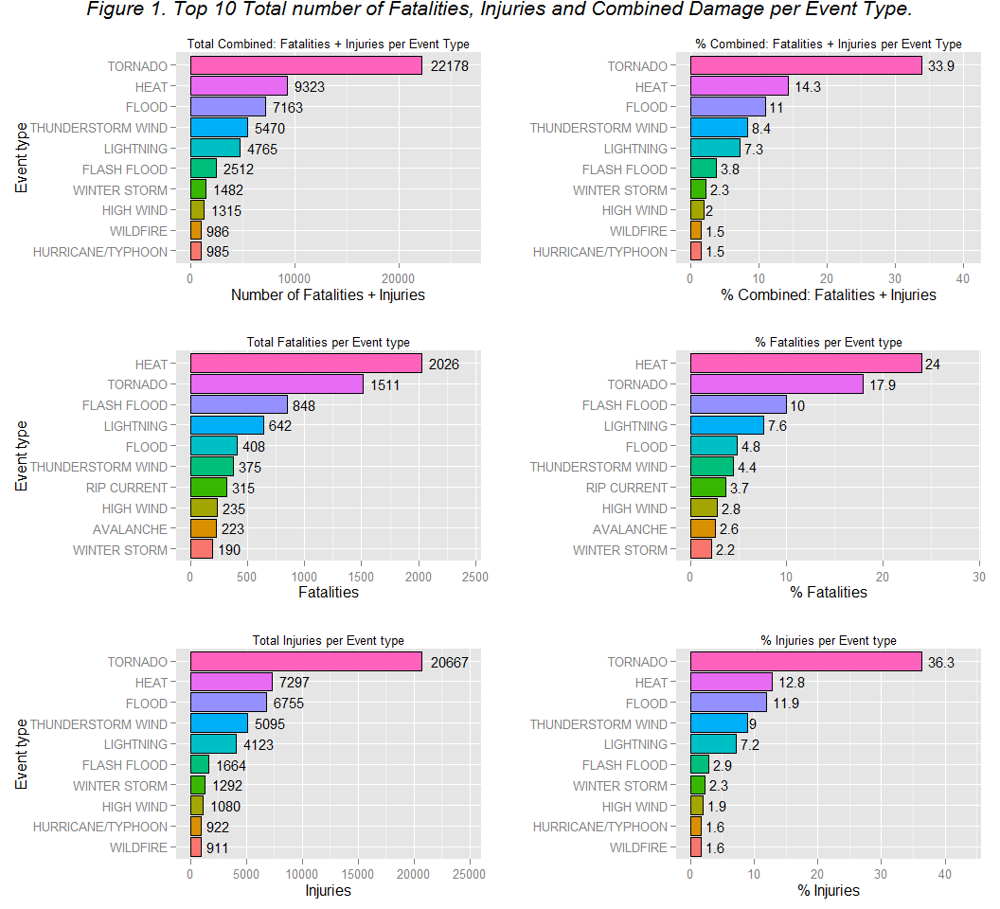

# Data Science - Reproducible Research - Peer Assessment 2 - Analysis of Weather Event in US and Harmful and Economic impact using NOAA Storm Database
by jmvilaverde  
Monday, June 15, 2015  


***


##Synopsis: 

Based on data extracted from NOAA Storm Database for event registered in US from year 1996 to present, and analyzed with the procedure described in next section _Data Processing_, are obtained the subsequent conclusions:

Human harmful:
* *TOP 3* most harmful events are *TORNADO (33.9%), HEAT (14.3%) and FLOOD (11%)* that causes *59.2 %* of total harmful of all events. 
* *TOP 10* causes *86 %* of total harmful, it is a total of *56179 fatalities or people injured*.

Economic damages:
* *TOP 3* event types that causes most economic damages are *FLOOD (37.4%), HURRICANTE/TYPHOON (18%) and STORM SURGE (10.9%)* that causes *66.3 %* of total Economic damage of all events. 
* *TOP 10* causes *91.8 %* of total economic damages, over *397 Billion $*.

_Can view detail in section Results._

***

##Data Processing

####1.First step, adquire the date from [https://d396qusza40orc.cloudfront.net/repdata%2Fdata%2FStormData.csv.bz2] and put it into a data frame container:


```r
#Set data path, using setInternet2 to avoid problems with https download
setInternet2(use = TRUE)
dataPath <- "https://d396qusza40orc.cloudfront.net/repdata%2Fdata%2FStormData.csv.bz2"
fileName <- "StormData.csv.bz2"

#Download the file
if (!file.exists(fileName)) download.file(url = dataPath, destfile = fileName)

#Extract bz2 file to a dataframe
dataInitial <- read.csv(bzfile(fileName))
```

As additional information, on http://www.ncdc.noaa.gov/stormevents/details.jsp?type=eventtype
inform about information recolection, and only have a complete collection from 1996 to present:
_3. All Event Types (48 from Directive 10-1605): From 1996 to present, 48 event types are recorded as defined in NWS Directive 10-1605._

Because only have a complete collection from 1996 to present is taken as criteria to filter the data to keep only information from 1996 to present.

####2.Get only relevant fields:


```r
#Identify fields
names(dataInitial)
```

```
##  [1] "STATE__"    "BGN_DATE"   "BGN_TIME"   "TIME_ZONE"  "COUNTY"    
##  [6] "COUNTYNAME" "STATE"      "EVTYPE"     "BGN_RANGE"  "BGN_AZI"   
## [11] "BGN_LOCATI" "END_DATE"   "END_TIME"   "COUNTY_END" "COUNTYENDN"
## [16] "END_RANGE"  "END_AZI"    "END_LOCATI" "LENGTH"     "WIDTH"     
## [21] "F"          "MAG"        "FATALITIES" "INJURIES"   "PROPDMG"   
## [26] "PROPDMGEXP" "CROPDMG"    "CROPDMGEXP" "WFO"        "STATEOFFIC"
## [31] "ZONENAMES"  "LATITUDE"   "LONGITUDE"  "LATITUDE_E" "LONGITUDE_"
## [36] "REMARKS"    "REFNUM"
```

For our process are needed: BGN_DATE, STATE, EVTYPE, FATALITIES, INJURIES, PROPDMG, PROPDMGEXP, CROPDMG, CROPDMGEXP.

Are relevant for filter Date (BGN_DATE) and States (STATE).

####3.Analyze BGN_DATE and STATE, in order to know what class have the data and how to process it: 


```r
#Identify structure
str(dataInitial$BGN_DATE)
```

```
##  Factor w/ 16335 levels "1/1/1966 0:00:00",..: 6523 6523 4242 11116 2224 2224 2260 383 3980 3980 ...
```

```r
head(dataInitial$BGN_DATE)
```

```
## [1] 4/18/1950 0:00:00  4/18/1950 0:00:00  2/20/1951 0:00:00 
## [4] 6/8/1951 0:00:00   11/15/1951 0:00:00 11/15/1951 0:00:00
## 16335 Levels: 1/1/1966 0:00:00 1/1/1972 0:00:00 ... 9/9/2011 0:00:00
```

```r
str(dataInitial$STATE)
```

```
##  Factor w/ 72 levels "AK","AL","AM",..: 2 2 2 2 2 2 2 2 2 2 ...
```

BGN_DATE and STATE are factors.

####4.We need to transform BGN_DATE from factor into a Date class in order to filter by year.


```r
#Use library lubridate to manage Date
library(lubridate)

#Transform BGN_DATE into a class  Date
dataInitial$date <- as.Date(dataInitial$BGN_DATE, format = "%m/%d/%Y")
class(dataInitial$date)
```

```
## [1] "Date"
```

```r
#Data filtered by year >= 1996
dataYearProcessed <- dataInitial[year(dataInitial$date)>=1996,]

#Percent of data removed filtering by Year
percentDataRemYear <- round((1-(nrow(dataYearProcessed)/nrow(dataInitial))) * 100, 2)
```

This filter has removed 27.57% of data.

####5.Filter to get only data from US States:


```r
#Data filtered by States
dataStatesProcessed <- dataYearProcessed[dataYearProcessed$STATE %in% state.abb,]

#Percent of data removed filtering by State
percentDataRemStates <- round((1- (nrow(dataStatesProcessed)/nrow(dataYearProcessed)))*100, 2)
```

This filter has removed 2.86% of data from precedent filter.


####6.Select necesary fields: EVTYPE, FATALITIES, INJURIES, PROPDMG, PROPDMGEXP, CROPDMG, CROPDMGEXP.


```r
library(dplyr)
```

```
## 
## Attaching package: 'dplyr'
## 
## The following objects are masked from 'package:lubridate':
## 
##     intersect, setdiff, union
## 
## The following object is masked from 'package:stats':
## 
##     filter
## 
## The following objects are masked from 'package:base':
## 
##     intersect, setdiff, setequal, union
```

```r
#Select only necesary fields: Type of event, Number of fatalities, Number of injuries, Property damages, Property damages exponent,
#Crop damages, and Crop damages exponent.
dataStatesProcessed %>% 
        select(EVTYPE, FATALITIES, INJURIES, PROPDMG, PROPDMGEXP, CROPDMG, CROPDMGEXP) -> dataPreprocessed
```

####7.Evaluate event types and clean. Do this by unifying and removing event types:

Use [http://www.ncdc.noaa.gov/stormevents/pd01016005curr.pdf] as reference to clean types.

* Unify TSTM WIND with THUNDERSTORM WIND.
* Unify EXCESSIVE HEAT with HEAT.
* Remove Summary, that is not an Event Type.


```r
#Evaluate how many levels have the dataset
unique(dataPreprocessed$EVTYPE)
```

```
##   [1] WINTER STORM                   TORNADO                       
##   [3] TSTM WIND                      HAIL                          
##   [5] HIGH WIND                      HEAVY RAIN                    
##   [7] FLASH FLOOD                    FREEZING RAIN                 
##   [9] EXTREME COLD                   EXCESSIVE HEAT                
##  [11] LIGHTNING                      FUNNEL CLOUD                  
##  [13] EXTREME WINDCHILL              BLIZZARD                      
##  [15] URBAN/SML STREAM FLD           FLOOD                         
##  [17] TSTM WIND/HAIL                 WATERSPOUT                    
##  [19] RIP CURRENTS                   HEAVY SNOW                    
##  [21] Other                          Record dry month              
##  [23] Temperature record             WILD/FOREST FIRE              
##  [25] Minor Flooding                 ICE STORM                     
##  [27] STORM SURGE                    Ice jam flood (minor          
##  [29] High Wind                      DUST STORM                    
##  [31] STRONG WIND                    DUST DEVIL                    
##  [33] Tstm Wind                      DROUGHT                       
##  [35] DRY MICROBURST                 FOG                           
##  [37] ROUGH SURF                     Wind                          
##  [39] THUNDERSTORMS                  Heavy Surf                    
##  [41] HEAVY SURF                     Dust Devil                    
##  [43] Wind Damage                    Marine Accident               
##  [45] Snow                           AVALANCHE                     
##  [47] Freeze                         TROPICAL STORM                
##  [49] Snow Squalls                   Coastal Flooding              
##  [51] Heavy Rain                     Strong Wind                   
##  [53] WINDS                          WIND                          
##  [55] COASTAL FLOOD                  COASTAL STORM                 
##  [57] COASTALFLOOD                   Erosion/Cstl Flood            
##  [59] Heavy Rain and Wind            Light Snow/Flurries           
##  [61] Wet Month                      Wet Year                      
##  [63] SNOW                           DAMAGING FREEZE               
##  [65] Damaging Freeze                HURRICANE                     
##  [67] Beach Erosion                  Hot and Dry                   
##  [69] Flood/Flash Flood              Icy Roads                     
##  [71] High Surf                      Heavy Rain/High Surf          
##  [73] HIGH SURF                      Thunderstorm Wind             
##  [75] Rain Damage                    ICE JAM                       
##  [77] Unseasonable Cold              Early Frost                   
##  [79] Wintry Mix                     blowing snow                  
##  [81] STREET FLOODING                Record Cold                   
##  [83] Extreme Cold                   Ice Fog                       
##  [85] Excessive Cold                 Torrential Rainfall           
##  [87] Freezing Rain                  Landslump                     
##  [89] Late-season Snowfall           Hurricane Edouard             
##  [91] Coastal Storm                  Flood                         
##  [93] HEAVY RAIN/WIND                River Flooding                
##  [95] TIDAL FLOODING                 Tidal Flooding                
##  [97] Winter Weather                 Snow squalls                  
##  [99] Strong Winds                   Strong winds                  
## [101] RECORD WARM TEMPS.             Ice/Snow                      
## [103] Mudslide                       Glaze                         
## [105] Extended Cold                  Snow Accumulation             
## [107] Freezing Fog                   Drifting Snow                 
## [109] Whirlwind                      Heavy snow shower             
## [111] Heavy rain                     COASTAL FLOODING              
## [113] LATE SNOW                      Record May Snow               
## [115] Record Winter Snow             Heavy Precipitation           
## [117]  COASTAL FLOOD                 Record temperature            
## [119] Light snow                     Late Season Snowfall          
## [121] Gusty Wind                     small hail                    
## [123] Light Snow                     MIXED PRECIP                  
## [125] Black Ice                      Mudslides                     
## [127] Gradient wind                  Snow and Ice                  
## [129] COLD                           Freezing Spray                
## [131] DOWNBURST                      Summary Jan 17                
## [133] Summary of March 14            Summary of March 23           
## [135] Summary of March 24            Summary of April 3rd          
## [137] Summary of April 12            Summary of April 13           
## [139] Summary of April 21            Summary August 11             
## [141] Summary of April 27            Summary of May 9-10           
## [143] Summary of May 10              Summary of May 13             
## [145] Summary of May 14              Summary of May 22 am          
## [147] Summary of May 22 pm           Heatburst                     
## [149] Summary of May 26 am           Summary of May 26 pm          
## [151] Metro Storm, May 26            Summary of May 31 am          
## [153] Summary of May 31 pm           Summary of June 3             
## [155] Summary of June 4              Summary June 5-6              
## [157] Summary June 6                 Summary of June 11            
## [159] Summary of June 12             Summary of June 13            
## [161] Summary of June 15             Summary of June 16            
## [163] Summary June 18-19             Summary of June 23            
## [165] Summary of June 24             Summary of June 30            
## [167] Summary of July 2              Summary of July 3             
## [169] Summary of July 11             Summary of July 22            
## [171] Summary July 23-24             Summary of July 26            
## [173] Summary of July 29             Summary of August 1           
## [175] Summary August 2-3             Summary August 7              
## [177] Summary August 9               Summary August 10             
## [179] Summary August 17              Summary August 21             
## [181] Summary August 28              Summary September 4           
## [183] Summary September 20           Summary September 23          
## [185] Summary Sept. 25-26            Summary: Oct. 20-21           
## [187] Summary: October 31            Summary: Nov. 6-7             
## [189] Summary: Nov. 16               Microburst                    
## [191] wet micoburst                  HAIL/WIND                     
## [193] Hail(0.75)                     Funnel Cloud                  
## [195] Urban Flooding                 No Severe Weather             
## [197] Urban flood                    Urban Flood                   
## [199] Cold                           WINTER WEATHER                
## [201] Summary of May 22              Summary of June 6             
## [203] Summary August 4               Summary of June 10            
## [205] Summary of June 18             Summary September 3           
## [207] Summary: Sept. 18              Coastal Flood                 
## [209] coastal flooding               Small Hail                    
## [211] Record Temperatures            Light Snowfall                
## [213] Freezing Drizzle               Gusty wind/rain               
## [215] GUSTY WIND/HVY RAIN            Blowing Snow                  
## [217] Early snowfall                 Monthly Snowfall              
## [219] Record Heat                    Seasonal Snowfall             
## [221] Monthly Rainfall               Cold Temperature              
## [223] Sml Stream Fld                 Heat Wave                     
## [225] Thundersnow shower             NONE                          
## [227] COLD AND SNOW                  DAM BREAK                     
## [229] RAIN                           RAIN/SNOW                     
## [231] OTHER                          FREEZE                        
## [233] TSTM WIND (G45)                RECORD WARMTH                 
## [235] STRONG WINDS                   FREEZING DRIZZLE              
## [237] UNSEASONABLY WARM              SLEET/FREEZING RAIN           
## [239] BLACK ICE                      WINTRY MIX                    
## [241] BLOW-OUT TIDES                 UNSEASONABLY COLD             
## [243] UNSEASONABLY COOL              TSTM HEAVY RAIN               
## [245] UNSEASONABLY DRY               TSTM WIND 40                  
## [247] TSTM WIND 45                   HARD FREEZE                   
## [249] TSTM WIND (41)                 HEAT                          
## [251] RIVER FLOOD                    TSTM WIND (G40)               
## [253] RIP CURRENT                    TSTM WND                      
## [255] DENSE FOG                      Wintry mix                    
## [257]  TSTM WIND                     MUD SLIDE                     
## [259] MUDSLIDES                      MUDSLIDE                      
## [261] Frost                          Frost/Freeze                  
## [263] SNOW AND ICE                   WIND DAMAGE                   
## [265] RAIN (HEAVY)                   Record Warmth                 
## [267] Prolong Cold                   Cold and Frost                
## [269] RECORD COLD                    PROLONG COLD                  
## [271] Gusty Winds                    AGRICULTURAL FREEZE           
## [273] URBAN/SML STREAM FLDG          GUSTY WIND                    
## [275] SNOW SQUALL                    HEAVY SNOW SQUALLS            
## [277] SNOW/ICE                       GUSTY WINDS                   
## [279] SMALL HAIL                     SNOW SQUALLS                  
## [281] LAKE EFFECT SNOW               STRONG WIND GUST              
## [283] LATE FREEZE                    RECORD TEMPERATURES           
## [285] ICY ROADS                      RECORD SNOWFALL               
## [287] BLOW-OUT TIDE                  THUNDERSTORM                  
## [289] Hypothermia/Exposure           HYPOTHERMIA/EXPOSURE          
## [291] Lake Effect Snow               Mixed Precipitation           
## [293] Record High                    COASTALSTORM                  
## [295] LIGHT SNOW                     Snow and sleet                
## [297] Freezing rain                  Gusty winds                   
## [299] FUNNEL CLOUDS                  WATERSPOUTS                   
## [301] Blizzard Summary               FROST                         
## [303] ICE                            SUMMARY OF MARCH 24-25        
## [305] SUMMARY OF MARCH 27            SUMMARY OF MARCH 29           
## [307] GRADIENT WIND                  Icestorm/Blizzard             
## [309] Flood/Strong Wind              TSTM WIND AND LIGHTNING       
## [311] gradient wind                  SEVERE THUNDERSTORMS          
## [313] EXCESSIVE RAIN                 Freezing drizzle              
## [315] Mountain Snows                 URBAN/SMALL STRM FLDG         
## [317] WET MICROBURST                 Heavy surf and wind           
## [319] Mild and Dry Pattern           COLD AND FROST                
## [321] RECORD HEAT                     LIGHTNING                    
## [323] BEACH EROSION                  UNSEASONAL RAIN               
## [325] EARLY RAIN                     PROLONGED RAIN                
## [327] WINTERY MIX                    COASTAL FLOODING/EROSION      
## [329] UNSEASONABLY WET               HOT SPELL                     
## [331] HEAT WAVE                      UNSEASONABLY HOT              
## [333] UNSEASONABLY WARM AND DRY       TSTM WIND (G45)              
## [335] TSTM WIND  (G45)               HIGH WIND (G40)               
## [337] TSTM WIND (G35)                DRY WEATHER                   
## [339] TSTM WINDS                     FREEZING RAIN/SLEET           
## [341] ABNORMAL WARMTH                UNUSUAL WARMTH                
## [343] GLAZE                          WAKE LOW WIND                 
## [345] MONTHLY RAINFALL               COLD TEMPERATURES             
## [347] COLD WIND CHILL TEMPERATURES   MODERATE SNOW                 
## [349] MODERATE SNOWFALL              URBAN/STREET FLOODING         
## [351] COASTAL EROSION                UNUSUAL/RECORD WARMTH         
## [353] BITTER WIND CHILL              BITTER WIND CHILL TEMPERATURES
## [355] SEICHE                         TSTM                          
## [357] COASTAL  FLOODING/EROSION      SNOW DROUGHT                  
## [359] UNSEASONABLY WARM YEAR         HYPERTHERMIA/EXPOSURE         
## [361] SNOW/SLEET                     ROCK SLIDE                    
## [363] ICE PELLETS                    URBAN FLOOD                   
## [365] PATCHY DENSE FOG               RECORD COOL                   
## [367] RECORD WARM                    HOT WEATHER                   
## [369] RIVER FLOODING                 RECORD TEMPERATURE            
## [371] VOLCANIC ERUPTION              COOL SPELL                    
## [373] WIND ADVISORY                  GUSTY WIND/HAIL               
## [375] RED FLAG FIRE WX               FIRST FROST                   
## [377] EXCESSIVELY DRY                HEAVY SEAS                    
## [379] FLASH FLOOD/FLOOD              SNOW AND SLEET                
## [381] LIGHT SNOW/FREEZING PRECIP     VOG                           
## [383] EXCESSIVE RAINFALL             FLASH FLOODING                
## [385] MONTHLY PRECIPITATION          MONTHLY TEMPERATURE           
## [387] RECORD DRYNESS                 EXTREME WINDCHILL TEMPERATURES
## [389] MIXED PRECIPITATION            EXTREME WIND CHILL            
## [391] DRY CONDITIONS                 HEAVY RAINFALL                
## [393] REMNANTS OF FLOYD              EARLY SNOWFALL                
## [395] FREEZING FOG                   LANDSPOUT                     
## [397] DRIEST MONTH                   RECORD  COLD                  
## [399] LATE SEASON HAIL               EXCESSIVE SNOW                
## [401] WINTER MIX                     DRYNESS                       
## [403] FLOOD/FLASH/FLOOD              WIND AND WAVE                 
## [405] SEVERE THUNDERSTORM            LIGHT FREEZING RAIN           
## [407]  WIND                          MONTHLY SNOWFALL              
## [409] DRY                            RECORD RAINFALL               
## [411] RECORD PRECIPITATION           ICE ROADS                     
## [413] SLEET                          HIGH SEAS                     
## [415] ROUGH SEAS                     UNSEASONABLY WARM/WET         
## [417] UNSEASONABLY COOL & WET        TSTM WIND G45                 
## [419] NON SEVERE HAIL                RECORD SNOW                   
## [421] SNOW/FREEZING RAIN             SNOW/BLOWING SNOW             
## [423] NON-SEVERE WIND DAMAGE         UNUSUALLY COLD                
## [425] UNUSUALLY WARM                 WARM WEATHER                  
## [427] LANDSLUMP                      THUNDERSTORM WIND (G40)       
## [429] LANDSLIDE                      WALL CLOUD                    
## [431] HIGH WATER                     UNSEASONABLY WARM & WET       
## [433]  FLASH FLOOD                   LOCALLY HEAVY RAIN            
## [435] WIND GUSTS                     VOLCANIC ASH                  
## [437] LATE SEASON SNOW               GUSTY LAKE WIND               
## [439] ABNORMALLY DRY                 WINTER WEATHER MIX            
## [441] RED FLAG CRITERIA              WND                           
## [443] CSTL FLOODING/EROSION          SMOKE                         
## [445]  WATERSPOUT                    SNOW ADVISORY                 
## [447] EXTREMELY WET                  UNUSUALLY LATE SNOW           
## [449] VERY DRY                       RECORD LOW RAINFALL           
## [451] ROGUE WAVE                     SNOWMELT FLOODING             
## [453] PROLONG WARMTH                 ACCUMULATED SNOWFALL          
## [455] FALLING SNOW/ICE               DUST DEVEL                    
## [457] NON-TSTM WIND                  NON TSTM WIND                 
## [459] DRY SPELL                      BRUSH FIRE                    
## [461] GUSTY THUNDERSTORM WINDS       PATCHY ICE                    
## [463] SNOW SHOWERS                   HEAVY RAIN EFFECTS            
## [465] BLOWING DUST                   EXCESSIVE HEAT/DROUGHT        
## [467] NORTHERN LIGHTS                WIND CHILL                    
## [469] HAZARDOUS SURF                 WILDFIRE                      
## [471] FROST/FREEZE                   WINTER WEATHER/MIX            
## [473] ASTRONOMICAL HIGH TIDE         WHIRLWIND                     
## [475] VERY WARM                      ABNORMALLY WET                
## [477] TORNADO DEBRIS                 EXTREME COLD/WIND CHILL       
## [479] ICE ON ROAD                    FIRST SNOW                    
## [481] ICE/SNOW                       DROWNING                      
## [483] GUSTY THUNDERSTORM WIND        HEAVY SURF/HIGH SURF          
## [485] TROPICAL DEPRESSION            SLEET STORM                   
## [487] HURRICANE/TYPHOON              STORM SURGE/TIDE              
## [489] COLD/WIND CHILL                LAKE-EFFECT SNOW              
## [491] THUNDERSTORM WIND              TSUNAMI                       
## [493] DENSE SMOKE                    LAKESHORE FLOOD               
## [495] ASTRONOMICAL LOW TIDE         
## 985 Levels:    HIGH SURF ADVISORY  COASTAL FLOOD ... WND
```

```r
##Running the report, are detected some Events that are repeated in the top 10 table.
#TSTM WIND it's the same as THUNDERSTORM WIND. We make the sustitution on data
dataPreprocessed[grepl(pattern = "TSTM WIND", x=dataPreprocessed$EVTYPE),]$EVTYPE <- "THUNDERSTORM WIND"

#EXCESSIVE HEAT it's the same as HEAT. We make the sustitution on data
dataPreprocessed[grepl(pattern = "EXCESSIVE HEAT", x=dataPreprocessed$EVTYPE),]$EVTYPE <- "HEAT"

#Remove Summary from event type
dataPreprocessed <- dataPreprocessed[!grepl(pattern = "Summary", x=dataPreprocessed$EVTYPE),]
```

####8.Analyze content of PROPDMGEXP and CROPDMGEXP:


```r
summary(dataPreprocessed$PROPDMGEXP)
```

```
##             -      ?      +      0      1      2      3      4      5 
## 266666      0      0      0      1      0      0      0      0      0 
##      6      7      8      B      h      H      K      m      M 
##      0      0      0     31      0      0 360754      0   7301
```

```r
summary(dataPreprocessed$CROPDMGEXP)
```

```
##             ?      0      2      B      k      K      m      M 
## 362882      0      0      0      4      0 270121      0   1746
```

Use as EXP values B, M and K.

####9.Create new columns: 

* HealthDamage = FATALITIES + INJURIES
* Transform PROPDMGEXP and CROPDMGEXP into a number: B -> 10^9, M -> 10^6, K -> 10^3
* PropertyDamage = PROPDMG * newPROPDMGEXP
* CropDamage = CROPDMG * newCROPDMGEXP


```r
#Create Health harm total
dataPreprocessed %>%
         mutate(HealthDamage = FATALITIES + INJURIES) -> dataPreprocessed

#Create Property damage total
#Type of exponents -> Billion, Million, K thousand
dataPreprocessed %>%
         mutate(multiPROPDM = ifelse(PROPDMGEXP == 'B', 10^9, 
                                     ifelse(PROPDMGEXP == 'M', 10^6, 
                                            ifelse(PROPDMGEXP == 'K', 10^3, 1)))) %>%
         mutate(PropDamage = as.numeric(multiPROPDM) * as.numeric(PROPDMG)) -> dataPreprocessed

#Create Crop damage total
#Type of exponents -> Billion, Million, K thousand
dataPreprocessed %>%
         mutate(multiCROPDM = ifelse(CROPDMGEXP == 'B', 10^9, 
                                     ifelse(CROPDMGEXP == 'M', 10^6, 
                                            ifelse(CROPDMGEXP == 'K', 10^3, 1)))) %>%
         mutate(CropDamage = as.numeric(multiCROPDM) * as.numeric(CROPDMG)) -> dataPreprocessed

#Create Damage total
dataPreprocessed %>%
         mutate(EconomicDamage = PropDamage + CropDamage) -> dataPreprocessed

summary(dataPreprocessed)
```

```
##                EVTYPE         FATALITIES          INJURIES       
##  THUNDERSTORM WIND:210931   Min.   :  0.0000   Min.   :0.00e+00  
##  HAIL             :207684   1st Qu.:  0.0000   1st Qu.:0.00e+00  
##  FLASH FLOOD      : 50011   Median :  0.0000   Median :0.00e+00  
##  FLOOD            : 23873   Mean   :  0.0133   Mean   :8.97e-02  
##  TORNADO          : 23139   3rd Qu.:  0.0000   3rd Qu.:0.00e+00  
##  HIGH WIND        : 19874   Max.   :158.0000   Max.   :1.15e+03  
##  (Other)          : 99241                                        
##     PROPDMG          PROPDMGEXP        CROPDMG         CROPDMGEXP    
##  Min.   :   0.00   K      :360754   Min.   :  0.00          :362882  
##  1st Qu.:   0.00          :266666   1st Qu.:  0.00   K      :270121  
##  Median :   0.00   M      :  7301   Median :  0.00   M      :  1746  
##  Mean   :  11.95   B      :    31   Mean   :  1.88   B      :     4  
##  3rd Qu.:   1.50   0      :     1   3rd Qu.:  0.00   ?      :     0  
##  Max.   :5000.00   -      :     0   Max.   :990.00   0      :     0  
##                    (Other):     0                    (Other):     0  
##   HealthDamage       multiPROPDM          PropDamage       
##  Min.   :   0.000   Min.   :1.000e+00   Min.   :0.000e+00  
##  1st Qu.:   0.000   1st Qu.:1.000e+00   1st Qu.:0.000e+00  
##  Median :   0.000   Median :1.000e+03   Median :0.000e+00  
##  Mean   :   0.103   Mean   :6.091e+04   Mean   :5.722e+05  
##  3rd Qu.:   0.000   3rd Qu.:1.000e+03   3rd Qu.:2.000e+03  
##  Max.   :1308.000   Max.   :1.000e+09   Max.   :1.150e+11  
##                                                            
##   multiCROPDM          CropDamage        EconomicDamage     
##  Min.   :1.000e+00   Min.   :0.000e+00   Min.   :0.000e+00  
##  1st Qu.:1.000e+00   1st Qu.:0.000e+00   1st Qu.:0.000e+00  
##  Median :1.000e+00   Median :0.000e+00   Median :0.000e+00  
##  Mean   :9.478e+03   Mean   :5.361e+04   Mean   :6.258e+05  
##  3rd Qu.:1.000e+03   3rd Qu.:0.000e+00   3rd Qu.:2.000e+03  
##  Max.   :1.000e+09   Max.   :1.510e+09   Max.   :1.150e+11  
## 
```


####10.Create TOP10 data sets Harmful and Economic damages:


```r
##TOP per Event Type
#Set top to 10
top <- 10

##TOP of Combined Health Harmful per Event Type
#Group by EVTYPE and sum all HealthDamage, rename columns and order desc by HealthDamage
dataAgregateCombined <- with(dataPreprocessed, aggregate(HealthDamage, list(EVTYPE), sum))
dataAgregateCombined <- rename(dataAgregateCombined, EventType = Group.1, HealthDamage = x)
dataAgrCombinedTop <- arrange(dataAgregateCombined, desc(HealthDamage))[1:top,]

#Change the factor order
dataAgrCombinedTop$EventType <- factor(dataAgrCombinedTop$EventType, levels = dataAgrCombinedTop$EventType[order(dataAgrCombinedTop$HealthDamage)])

#Calculate total Health damage and total Health damage per TOP10 and TOP3
totalHealthDamage <- sum(dataAgregateCombined$HealthDamage)
total.HealthDamage.Top10 <- sum(dataAgrCombinedTop$HealthDamage)
total.HealthDamage.Top3 <- sum(dataAgrCombinedTop$HealthDamage[1:3])

#Calculate percent of Health damage per Event Type
dataAgrCombinedTop %>% mutate(percentHealthDamage = round(HealthDamage / totalHealthDamage * 100,1)) -> dataAgrCombinedTop


##TOP of Fatalities per Event Type
#Group by EVTYPE and sum all FATALITIES, rename columns and order desc by FATALITIES
dataAgregateFatalities <- with(dataPreprocessed, aggregate(FATALITIES, list(EVTYPE), sum))
dataAgregateFatalities <- rename(dataAgregateFatalities, EventType = Group.1, FATALITIES = x)
dAFatalitiesTop <-arrange(dataAgregateFatalities,desc(FATALITIES))[1:top,]

#Change the factor order
dAFatalitiesTop$EventType <- factor(dAFatalitiesTop$EventType, levels = dAFatalitiesTop$EventType[order(dAFatalitiesTop$FATALITIES)])

#Calculate total FATALITIES 
totalFatalities <- sum(dataAgregateFatalities$FATALITIES)

#Calculate percent of FATALITIES  per Event Type
dAFatalitiesTop %>% mutate(percentFatalities = round(FATALITIES / totalFatalities * 100,1)) -> dAFatalitiesTop


##TOP of Injuries per Event Type
#Group by EVTYPE and sum all INJURIES, rename columns and order desc by INJURIES
dataAgregateINJURIES <- with(dataPreprocessed, aggregate(INJURIES, list(EVTYPE), sum))
dataAgregateINJURIES <- rename(dataAgregateINJURIES, EventType = Group.1, INJURIES = x)
dAInjuriesTop <- arrange(dataAgregateINJURIES, desc(INJURIES))[1:top,]

#Calculate total INJURIES 
totalInjuries <- sum(dataAgregateINJURIES$INJURIES)

#Calculate percent of INJURIES  per Event Type
dAInjuriesTop %>% mutate(percentInjuries = round(INJURIES / totalInjuries * 100,1)) -> dAInjuriesTop

#Change the factor order
dAInjuriesTop$EventType <- factor(dAInjuriesTop$EventType, levels = dAInjuriesTop$EventType[order(dAInjuriesTop$INJURIES)])
```


```r
##TOP per Event Type
#Set top to 10
top <- 10

##TOP of Combined Economic Damage per Event Type
#Group by EVTYPE and sum all EconomicDamage, rename columns and order desc by EconomicDamage
dataAgregate.EconomicDamage <- with(dataPreprocessed, aggregate(EconomicDamage, list(EVTYPE), sum))
dataAgregate.EconomicDamage <- rename(dataAgregate.EconomicDamage, EventType = Group.1, EconomicDamage = x)
dataAgregate.EconomicDamage.Top <- arrange(dataAgregate.EconomicDamage, desc(EconomicDamage))[1:top,]

#Change the factor order
dataAgregate.EconomicDamage.Top$EventType <- factor(dataAgregate.EconomicDamage.Top$EventType, levels = dataAgregate.EconomicDamage.Top$EventType[order(dataAgregate.EconomicDamage.Top$EconomicDamage)])

#Calculate total Health damage and total Health damage per TOP10 and TOP3
total.EconomicDamage <- sum(dataAgregate.EconomicDamage$EconomicDamage)
total.EconomicDamage.Top10 <- sum(dataAgregate.EconomicDamage$EconomicDamage.Top)
total.EconomicDamage.Top3 <- sum(dataAgregate.EconomicDamage$EconomicDamage.Top[1:3])
total.EconomicDamage.Top10
```

```
## [1] 0
```

```r
total.EconomicDamage.Top3
```

```
## [1] 0
```

```r
#Calculate percent of Health damage per Event Type
dataAgregate.EconomicDamage.Top %>% 
        mutate(percent.EconomicDamage = round(EconomicDamage / total.EconomicDamage * 100,1)) -> dataAgregate.EconomicDamage.Top


##TOP of Prop Damages per Event Type
#Group by EVTYPE and sum all PropDamage, rename columns and order desc by PropDamage
dataAgregate.PropDamage <- with(dataPreprocessed, aggregate(PropDamage, list(EVTYPE), sum))
dataAgregate.PropDamage <- rename(dataAgregate.PropDamage, EventType = Group.1, PropDamage = x)
dataAgregate.PropDamage.Top <-arrange(dataAgregate.PropDamage,desc(PropDamage))[1:top,]

#Change the factor order
dataAgregate.PropDamage.Top$EventType <- factor(dataAgregate.PropDamage.Top$EventType, levels = dataAgregate.PropDamage.Top$EventType[order(dataAgregate.PropDamage.Top$PropDamage)])

#Calculate total FATALITIES 
total.PropDamage <- sum(dataAgregate.PropDamage$PropDamage)

#Calculate percent of FATALITIES  per Event Type
dataAgregate.PropDamage.Top %>% 
        mutate(percent.PropDamage = round(PropDamage / total.PropDamage * 100,1)) -> dataAgregate.PropDamage.Top


##TOP of Crop Damages per Event Type
#Group by EVTYPE and sum all CropDamage, rename columns and order desc by CropDamage
dataAgregate.CropDamage <- with(dataPreprocessed, aggregate(CropDamage, list(EVTYPE), sum))
dataAgregate.CropDamage <- rename(dataAgregate.CropDamage, EventType = Group.1, CropDamage = x)
dataAgregate.CropDamage.Top <- arrange(dataAgregate.CropDamage, desc(CropDamage))[1:top,]

#Calculate total INJURIES 
total.CropDamage <- sum(dataAgregate.CropDamage$CropDamage)

#Calculate percent of INJURIES  per Event Type
dataAgregate.CropDamage.Top %>% 
        mutate(percent.CropDamage = round(CropDamage / total.CropDamage * 100,1)) -> dataAgregate.CropDamage.Top

#Change the factor order
dataAgregate.CropDamage.Top$EventType <- factor(dataAgregate.CropDamage.Top$EventType, levels = dataAgregate.CropDamage.Top$EventType[order(dataAgregate.CropDamage.Top$CropDamage)])
```

####11. Code to generate plots that shows Top 10 Event type per Fatalities, Injuries and combined of both:


```r
library(ggplot2)

#Var to define margin to put labels over bars on plot
barMargin <- 1.2

##Plot combined Harmful 

#Change factor order to plotting
dataAgrCombinedTop$EventType <- factor(dataAgrCombinedTop$EventType, 
                                       levels = dataAgrCombinedTop$EventType[order(dataAgrCombinedTop$HealthDamage)])

# getPlot <- function(dataPlot, xfield, yfield, xlabel, ylabel, title){
#         g <- ggplot(data=dataPlot, aes(x=xfield, y=yfield , fill=xfield))
#         g <- g + geom_bar(stat="identity", show_guide = FALSE, colour="black")
#         g <- g + ylim(0, max(yfield)*1.2)
#         g <- g + coord_flip() + geom_text(aes(label=yfield), hjust=-.25, vjust=0.5, size=4)
#         g <- g + xlab(xlabel) + ylab(ylabel)
#         g <- g + ggtitle(title)
#         g
#         #return ggplot.resultant
# }
# 
# ggplotCombined <- getPlot(dataPlot = dataAgrCombinedTop, xfield = dataAgrCombinedTop$EventType, 
#                           yfield = dataAgrCombinedTop$HealthDamage, xlabel = "Event type",
#                           ylabel = "Combined: Fatalities + Injuries", 
#                           title = "Top 10 Event type per Total Combined: Fatalities + Injuries")

##Common parameters
titleSize <- 10
gb <- geom_bar(stat="identity", show_guide = FALSE, colour="black")
t <- theme(plot.title = element_text(size=titleSize))
#gcommon <- gb + t     


g <- ggplot(data=dataAgrCombinedTop, aes(x=EventType, y=HealthDamage, fill=EventType))
g <- g + gb
g <- g + ylim(0, dataAgrCombinedTop$HealthDamage[1]*barMargin)
g <- g + coord_flip() + geom_text(aes(label=HealthDamage), hjust=-.25, vjust=0.5, size=4)
g <- g + xlab("Event type") + ylab("Number of Fatalities + Injuries") 
g <- g + ggtitle("Total Combined: Fatalities + Injuries per Event Type")
ggplotCombined <- g + t

        g <- ggplot(data=dataAgrCombinedTop, aes(x=EventType, y=percentHealthDamage , fill=EventType))
        g <- g + gb
        g <- g + ylim(0, dataAgrCombinedTop$percentHealthDamage[1]*barMargin)
        g <- g + coord_flip() + geom_text(aes(label=percentHealthDamage), hjust=-.25, vjust=0.5, size=4)
        g <- g + xlab("") + ylab("% Combined: Fatalities + Injuries")
        g <- g + ggtitle("% Combined: Fatalities + Injuries per Event Type")
        ggplotCombinedPercent <- g + t

g <- ggplot(data=dAFatalitiesTop, aes(x=EventType, y=FATALITIES , fill=EventType))
g <- g + gb
g <- g + ylim(0, dAFatalitiesTop$FATALITIES[1]*1.2)
g <- g + coord_flip() + geom_text(aes(label=FATALITIES), hjust=-0.25, vjust=0.5, size=4)
g <- g + xlab("Event type") + ylab("Fatalities")
g <- g + ggtitle("Total Fatalities per Event type")
ggplotFatalities <- g + t

        g <- ggplot(data=dAFatalitiesTop, aes(x=EventType, y=percentFatalities , fill=EventType))
        g <- g + gb
        g <- g + ylim(0, dAFatalitiesTop$percentFatalities[1]*barMargin)
        g <- g + coord_flip() + geom_text(aes(label=percentFatalities), hjust=-.25, vjust=0.5, size=4)
        g <- g + xlab("") + ylab("% Fatalities")
        g <- g + ggtitle("% Fatalities per Event type")
        ggplotFatalitiesPercent <- g + t

g <- ggplot(data=dAInjuriesTop, aes(x=EventType, y=INJURIES , fill=EventType))
g <- g + gb
g <- g + ylim(0, dAInjuriesTop$INJURIES[1]*barMargin)
g <- g + coord_flip() + geom_text(aes(label=INJURIES), hjust=-.25, vjust=0.5, size=4)
g <- g + xlab("Event type") + ylab("Injuries")
g <- g + ggtitle("Total Injuries per Event type")
ggplotInjuries <- g + t

        g <- ggplot(data=dAInjuriesTop, aes(x=EventType, y=percentInjuries , fill=EventType))
        g <- g + gb
        g <- g + ylim(0, dAInjuriesTop$percentInjuries[1]*barMargin)
        g <- g + coord_flip() + geom_text(aes(label=percentInjuries), hjust=-.25, vjust=0.5, size=4)
        g <- g + xlab("") + ylab("% Injuries")
        g <- g + ggtitle("% Injuries per Event type")
        ggplotInjuriesPercent <- g + t


require(gridExtra)
grid.arrange(ggplotCombined, ggplotCombinedPercent,
             ggplotFatalities, ggplotFatalitiesPercent, 
             ggplotInjuries, ggplotInjuriesPercent, 
             nrow = 3, ncol=2,
             main=textGrob("Figure 1. Top 10 Total number of Fatalities, Injuries and Combined Damage per Event Type."
                           ,gp=gpar(fontsize=16,font=3))
             )
```

####12.Create Table combined Harmful (Fatalities + Injuries):


```r
#Use library xtable to generate html table
library(xtable)
xtableHarmful <- xtable(select(dataAgrCombinedTop, EventType, HealthDamage, percentHealthDamage))
print(xtableHarmful, type = "html")
```


####13.Code to generate plots that shows Top 10 Event type per Property damages, Crop damages and combined of both:


```r
library(ggplot2)

#Common values for plots
titleSize <- 10
gb <- geom_bar(stat="identity", show_guide = FALSE, colour="black")
t <- theme(plot.title = element_text(size=titleSize))
barMargin <- 1.2
unitsDollars <- 10^9
labelDollars <- "US$ Billions"
titleSize <- 10
##Plot combined Harmful 

g <- ggplot(data=dataAgregate.EconomicDamage.Top, aes(x=EventType, y=EconomicDamage/unitsDollars, fill=EventType))
g <- g + gb
g <- g + ylim(0, dataAgregate.EconomicDamage.Top$EconomicDamage[1]/unitsDollars*barMargin)
g <- g + coord_flip() + geom_text(aes(label=round(EconomicDamage/unitsDollars,1)), hjust=-.25, vjust=0.5, size=4)
g <- g + xlab("Event type") + ylab(labelDollars)
g <- g + ggtitle("Event type vs. Economic Damage: Property + Crops")
ggplot.EconomicDamage <- g + t

        g <- ggplot(data=dataAgregate.EconomicDamage.Top, aes(x=EventType, y=percent.EconomicDamage , fill=EventType))
        g <- g + gb
        g <- g + ylim(0, dataAgregate.EconomicDamage.Top$percent.EconomicDamage[1]*barMargin)
        g <- g + coord_flip() + geom_text(aes(label=percent.EconomicDamage), hjust=-.25, vjust=0.5, size=4)
        g <- g + xlab("") + ylab("% over Total Economic Damage: Property + Crops")
        g <- g + ggtitle("Event type vs. % Economic Damage: Property + Crops")
        ggplot.EconomicDamage.Percent <- g + t
        
g <- ggplot(data=dataAgregate.PropDamage.Top, aes(x=EventType, y=PropDamage/unitsDollars, fill=EventType))
g <- g + gb
g <- g + ylim(0, dataAgregate.PropDamage.Top$PropDamage[1]/unitsDollars*barMargin)
g <- g + coord_flip() + geom_text(aes(label=round(PropDamage/unitsDollars,1)), hjust=-.25, vjust=0.5, size=4)
g <- g + xlab("Event type") + ylab(labelDollars)
g <- g + ggtitle("Top 10 Event type vs. Property Damage")
ggplot.PropDamage <- g + t

        g <- ggplot(data=dataAgregate.PropDamage.Top, aes(x=EventType, y=percent.PropDamage, fill=EventType))
        g <- g + gb
        g <- g + ylim(0, dataAgregate.PropDamage.Top$percent.PropDamage[1]*barMargin)
        g <- g + coord_flip() + geom_text(aes(label=percent.PropDamage), hjust=-.25, vjust=0.5, size=4)
        g <- g + xlab("") + ylab("% over Total Property Damage")
        g <- g + ggtitle("Top 10 Event type vs. % Property Damage")
        ggplot.PropDamage.Percent <- g + t

g <- ggplot(data=dataAgregate.CropDamage.Top, aes(x=EventType, y=CropDamage/unitsDollars, fill=EventType))
g <- g + gb
g <- g + ylim(0, dataAgregate.CropDamage.Top$CropDamage[1]/unitsDollars*barMargin)
g <- g + coord_flip() + geom_text(aes(label=round(CropDamage/unitsDollars,1)), hjust=-.25, vjust=0.5, size=4)
g <- g + xlab("Event type") + ylab(labelDollars)
g <- g + ggtitle("Top 10 Event type vs. Crop Damage")
ggplot.CropDamage <- g + t

        g <- ggplot(data=dataAgregate.CropDamage.Top, aes(x=EventType, y=percent.CropDamage, fill=EventType))
        g <- g + gb
        g <- g + ylim(0, dataAgregate.CropDamage.Top$percent.CropDamage[1]*barMargin)
        g <- g + coord_flip() + geom_text(aes(label=percent.CropDamage), hjust=-.25, vjust=0.5, size=4)
        g <- g + xlab("") + ylab("% over Total Crop Damage")
        g <- g + ggtitle("Top 10 Event type vs. % Crop Damage")
        ggplot.CropDamage.Percent <- g + t

require(gridExtra)
```

```
## Loading required package: gridExtra
## Loading required package: grid
```

```r
grid.arrange(ggplot.EconomicDamage, ggplot.EconomicDamage.Percent,
             ggplot.PropDamage, ggplot.PropDamage.Percent,
             ggplot.CropDamage, ggplot.CropDamage.Percent,
             nrow = 3, ncol=2,
             main=textGrob("Figure 2. Top 10 Event Type per Property, Crops and Combined Economic Damage."
                           ,gp=gpar(fontsize=16,font=3))
             )
```

 

####14.Create Table Economic Damage:


```r
#Use library xtable to generate html table
library(xtable)
xtable.EconomicDamage <- xtable(select(dataAgregate.EconomicDamage.Top, EventType, EconomicDamage, percent.EconomicDamage))
print(xtable.EconomicDamage, type = "html")
```

##Results

###Across the United States, which types of events (as indicated in the EVTYPE variable) are most harmful with respect to population health?

####TOP 10 most harmful effects to poblation are:

<!-- html table generated in R 3.2.0 by xtable 1.7-4 package -->
<!-- Wed Jun 17 19:50:28 2015 -->
<table border=1>
<tr> <th>  </th> <th> EventType </th> <th> HealthDamage </th> <th> percentHealthDamage </th>  </tr>
  <tr> <td align="right"> 1 </td> <td> TORNADO </td> <td align="right"> 22178.00 </td> <td align="right"> 33.90 </td> </tr>
  <tr> <td align="right"> 2 </td> <td> HEAT </td> <td align="right"> 9323.00 </td> <td align="right"> 14.30 </td> </tr>
  <tr> <td align="right"> 3 </td> <td> FLOOD </td> <td align="right"> 7163.00 </td> <td align="right"> 11.00 </td> </tr>
  <tr> <td align="right"> 4 </td> <td> THUNDERSTORM WIND </td> <td align="right"> 5470.00 </td> <td align="right"> 8.40 </td> </tr>
  <tr> <td align="right"> 5 </td> <td> LIGHTNING </td> <td align="right"> 4765.00 </td> <td align="right"> 7.30 </td> </tr>
  <tr> <td align="right"> 6 </td> <td> FLASH FLOOD </td> <td align="right"> 2512.00 </td> <td align="right"> 3.80 </td> </tr>
  <tr> <td align="right"> 7 </td> <td> WINTER STORM </td> <td align="right"> 1482.00 </td> <td align="right"> 2.30 </td> </tr>
  <tr> <td align="right"> 8 </td> <td> HIGH WIND </td> <td align="right"> 1315.00 </td> <td align="right"> 2.00 </td> </tr>
  <tr> <td align="right"> 9 </td> <td> WILDFIRE </td> <td align="right"> 986.00 </td> <td align="right"> 1.50 </td> </tr>
  <tr> <td align="right"> 10 </td> <td> HURRICANE/TYPHOON </td> <td align="right"> 985.00 </td> <td align="right"> 1.50 </td> </tr>
   </table>

Top 10 is 86 % of total Harmful of all events. 
Top 10 caused a total of 56179 victims.

Top 3 is 59.2 % of total Harmful of all events. 
Top 3 caused a total of  38664 victims.


####Detailed graph:

 


##Across the United States, which types of events have the greatest economic consequences?

####TOP 10 event type with greatest economic consequences are:

<!-- html table generated in R 3.2.0 by xtable 1.7-4 package -->
<!-- Wed Jun 17 19:50:29 2015 -->
<table border=1>
<tr> <th>  </th> <th> EventType </th> <th> EconomicDamage </th> <th> percent.EconomicDamage </th>  </tr>
  <tr> <td align="right"> 1 </td> <td> FLOOD </td> <td align="right"> 148745225950.00 </td> <td align="right"> 37.40 </td> </tr>
  <tr> <td align="right"> 2 </td> <td> HURRICANE/TYPHOON </td> <td align="right"> 71636600800.00 </td> <td align="right"> 18.00 </td> </tr>
  <tr> <td align="right"> 3 </td> <td> STORM SURGE </td> <td align="right"> 43193466000.00 </td> <td align="right"> 10.90 </td> </tr>
  <tr> <td align="right"> 4 </td> <td> TORNADO </td> <td align="right"> 24900147720.00 </td> <td align="right"> 6.30 </td> </tr>
  <tr> <td align="right"> 5 </td> <td> HAIL </td> <td align="right"> 17071166370.00 </td> <td align="right"> 4.30 </td> </tr>
  <tr> <td align="right"> 6 </td> <td> FLASH FLOOD </td> <td align="right"> 16271058610.00 </td> <td align="right"> 4.10 </td> </tr>
  <tr> <td align="right"> 7 </td> <td> DROUGHT </td> <td align="right"> 14408462000.00 </td> <td align="right"> 3.60 </td> </tr>
  <tr> <td align="right"> 8 </td> <td> HURRICANE </td> <td align="right"> 12098928010.00 </td> <td align="right"> 3.00 </td> </tr>
  <tr> <td align="right"> 9 </td> <td> THUNDERSTORM WIND </td> <td align="right"> 8910913670.00 </td> <td align="right"> 2.20 </td> </tr>
  <tr> <td align="right"> 10 </td> <td> TROPICAL STORM </td> <td align="right"> 7988131550.00 </td> <td align="right"> 2.00 </td> </tr>
   </table>

Top 10 accumulate 91.8 % of total Harmful of all events. 
Top 10 caused a total of 0 US $ in economic damages.

Top 3 accumulate 66.3 % of total Harmful of all events. 
Top 3 caused a total of  0 US $ in economic damages.


####Here's a detailed graph:

 


